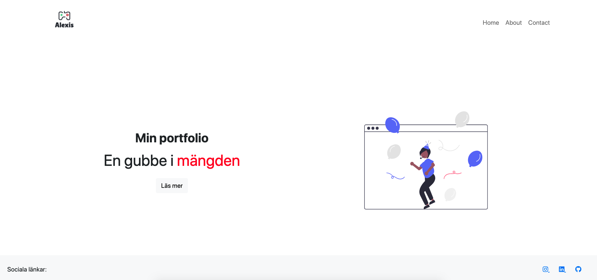
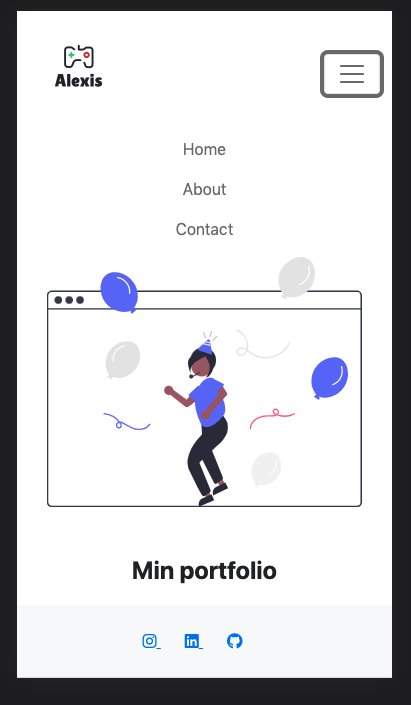

## Django Portolio med nginx och docker

------

Nu är tanken att vi ska göra våra egna mobilresponsiva hemsidor. Vi ska använda detta projekt fortlöppande i kursen. 

Vill ni inte göra en portfolio-hemsida kan ni antingen göra något helt annat, eller kopiera min sida.

Detta repo är tänkt dels som inspiration men även som en guide.

Om ni ser dess olika branches så kommer vi att steg-för-steg gå igenom hur vi gör en portfolio-hemsida i Django.

###### 01_setup

Sätt upp ett django-projekt

###### 02_pages

Skapa era första sidor.

###### 03_bootstrap

Snygga till sidan med Bootstrap css

###### 04_docker

Skapa vår först Dockerfile

###### 05_nginx

Gör projektet redo för produktion med hjälp av en proxy server.

###### fortsättning

Displaya projekt vi har jobbat med.

